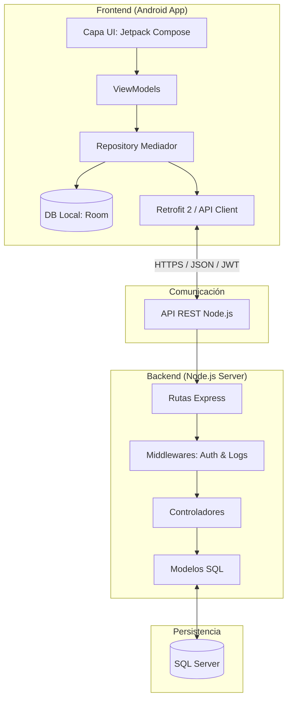

# GYM Tonic 🏋️‍♂️

GYM Tonic es una plataforma integral de fitness diseñada para gestionar rutinas de entrenamiento, ejercicios, retos semanales y comunidades de usuarios a través de una aplicación móvil robusta y un backend escalable.

---

## 1) Descripción del proyecto
GYM Tonic permite a los usuarios llevar un control exhaustivo de su actividad física. El sistema está diseñado bajo un enfoque **remote-first**, lo que significa que prioriza la sincronización con la nube pero mantiene capacidades de funcionamiento local mediante mocks y base de datos interna (Room).

**Funcionalidades principales:**
- Gestión y visualización de rutinas de entrenamiento personalizadas.
- Catálogo detallado de ejercicios con soporte para vídeo (ExoPlayer).
- Sistema de misiones y retos semanales para fomentar la gamificación.
- Gestión de grupos y amigos para fomentar la comunidad.
- Autenticación segura y gestión de perfiles.

---

## 2) Tecnologías utilizadas

### **Backend**
- **Entorno:** Node.js + Express.
- **Base de Datos:** SQL Server (`mssql`).
- **Seguridad:** JWT (JSON Web Tokens) para sesiones y `bcrypt` para hash de contraseñas.
- **Documentación:** Swagger (OpenAPI 3.0).
- **Logs:** Log4js y Morgan.
- **Correo:** Nodemailer.

### **Frontend**
- **Lenguaje:** Kotlin + Jetpack Compose.
- **Arquitectura:** MVVM (Model-View-ViewModel).
- **Red:** Retrofit 2 + Gson.
- **Base de Datos Local:** Room.
- **Persistencia de Sesión:** DataStore (Preferences).
- **Multimedia:** Coil (imágenes) y Media3/ExoPlayer (vídeos).
- **Autenticación:** Google Sign-In & Facebook Login.

---

## 3) Arquitectura general del sistema

El proyecto está diseñado bajo una arquitectura de **Sistemas Distribuidos** con un desacoplamiento total entre el cliente (Android) y el servidor (Node.js), siguiendo un enfoque **Remote-First**.

### **Estructura Conceptual**



### **3.1) Arquitectura del Frontend**
La aplicación móvil implementa el patrón **MVVM (Model-View-ViewModel)** junto con principios de **Clean Architecture**:
-   **Capa de Presentación:** Desarrollada con Jetpack Compose. Los ViewModels gestionan el estado de la UI y la lógica de interacción.
-   **Capa de Datos (Repository):** Actúa como *Single Source of Truth*. Gestiona la lógica de sincronización, decidiendo cuándo servir datos de la caché local (**Room**) o realizar una petición remota (**Retrofit 2**).
-   **Persistencia Local:** Garantiza que la aplicación sea funcional en entornos con conectividad limitada (offline-ready).

### **3.2) Arquitectura del Backend**
El servidor utiliza el framework **Express** estructurado de forma modular:
-   **Enrutamiento:** Endpoints versionados (`/api/v1/`) organizados por recursos.
-   **Seguridad:** Implementación de JWT para la protección de rutas y `bcrypt` para el manejo de credenciales.
-   **Controladores y Modelos:** Separación clara entre la orquestación de peticiones y el acceso directo a la base de datos **SQL Server**.
-   **Logs y Errores:** Sistema centralizado de trazabilidad mediante Morgan y Log4js.

---

## 4) Requisitos previos

Para poner en marcha el proyecto, es necesario disponer del siguiente software:

- **Base de Datos:**
  - **SQL Server Express:** Motor de base de datos.
  - **SQL Server Management Studio (SSMS):** Interfaz para la gestión de la base de datos.
- **Backend:**
  - **Node.js** (v18 o superior).
- **Frontend:**
  - **Android Studio** (Ladybug 2024.2.1 o superior).
  - **JDK 11** o superior.
- **General:**
  - **Git** para el control de versiones.

---

## 5) Instalación y Configuración

### **5.1) Configuración de SQL Server**
Para que el backend pueda comunicarse con SQL Server Express, siga estos pasos críticos:

1.  **Habilitar Protocolos de Red:**
    - Abra el **Administrador de configuración de SQL Server** (SQL Server Configuration Manager).
    - Navegue a **Configuración de red de SQL Server** > **Protocolos de SQLEXPRESS**.
    - Haga clic derecho en **TCP/IP** y seleccione **Habilitar**.
2.  **Configurar Direcciones IP y Puertos:**
    - Haga clic derecho en **TCP/IP** y vaya a **Propiedades**.
    - En la pestaña **Direcciones IP**:
      - Busque la dirección **127.0.0.1** (Localhost) y cambie **Habilitado** a **Sí**.
      - Vaya al final de la lista, a la sección **IPAll**.
      - Establezca **Puerto TCP** como `1433`.
      - Borre cualquier valor en **Puertos TCP dinámicos** (déjelo vacío).
3.  **Reiniciar el Servicio:**
    - En la misma ventana, vaya a **Servicios de SQL Server**.
    - Haga clic derecho en **SQL Server (SQLEXPRESS)** y seleccione **Reiniciar**.
4.  **Habilitar Autenticación Mixta:**
    - Abra **SQL Server Management Studio (SSMS)**.
    - Conéctese al servidor `localhost\SQLEXPRESS` mediante **Autenticación de Windows**.
    - Haga clic derecho sobre la conexión del servidor en el Explorador de objetos y seleccione **Propiedades**.
    - En la sección **Seguridad**, seleccione la opción **Modo de autenticación de Windows y SQL Server**.
    - Acepte los cambios y vuelva a **Reiniciar el servicio** de SQL Server por última vez.

### **5.2) Preparación del Backend**
1. Acceder a la carpeta `Backend/`.
2. Instalar dependencias:
   ```bash
   npm install
   ```
3. Configure el archivo `.env` con las credenciales de SQL Server (vea sección 8).
4. Ejecute los scripts SQL ubicados en `Backend/scripts/` para crear las tablas y datos base.

### **5.3) Preparación del Frontend**
1. Abra la carpeta `Frontend/` en Android Studio.
2. Sincronice el proyecto con los archivos Gradle.
3. Configure el archivo `local.properties` con las URLs del backend (vea sección 8).


---

## 6) Ejecución

### **6.1) Backend**
Para iniciar el servidor en modo desarrollo:
```bash
node index.js
```
El servidor escuchará por defecto en el puerto `3010`.

### **6.2) Frontend (Android)**
Puede ejecutar la aplicación de dos formas:

1.  **Emulador:** Inicie un dispositivo virtual desde el Device Manager de Android Studio.
2.  **Dispositivo Físico:**
    - Active las **Opciones de desarrollador** en su móvil (Ajustes > Información del teléfono > pulsar 7 veces en "Número de compilación").
    - Habilite la **Depuración USB** en el menú de opciones de desarrollador.
    - Conecte el móvil al PC mediante cable USB.
    - Seleccione su dispositivo en la barra superior de Android Studio y pulse **Run**.
    - *Nota:* Asegúrese de que el móvil y el PC estén en la misma red si utiliza la IP local del PC en `local.properties`.


---

## 7) Estructura del repositorio

```text
GYM Tonic/
├─ Backend/
│  ├─ controllers/         # Lógica de los endpoints
│  ├─ routes/              # Definición de rutas Express
│  ├─ middlewares/         # Auth, error handling, logs
│  ├─ models/              # Consultas SQL Server (DAO)
│  ├─ utils/               # Configuración (DB, JWT, Logger)
│  ├─ scripts/             # Scripts SQL (.sql y .md)
│  └─ public/              # Recursos estáticos (imágenes/vídeos)
└─ Frontend/
   └─ app/src/main/java/edu/gymtonic_app/
      ├─ data/             # Capa de Datos (Clean Architecture)
      │  ├─ remote/        # API, DTOs y Fuentes Remotas (Retrofit)
      │  ├─ local/         # Room DB, Entidades y DAOs
      │  └─ repository/    # Implementación de repositorios (Single Source of Truth)
      ├─ ui/               # Capa de Presentación
      │  ├─ screens/       # Pantallas de la aplicación (Compose)
      │  ├─ viewmodel/     # Lógica de estado y UI
      │  ├─ navigation/    # Rutas y grafos de navegación
      │  ├─ components/    # Componentes Compose reutilizables
      │  └─ theme/         # Sistema de diseño (Color, Type, Theme)
      └─ MainActivity.kt   # Punto de entrada y host de navegación
```

---

## 8) Configuración

### **Backend (.env)**
Es necesario crear un archivo `.env` en la raíz de `Backend/` con los siguientes parámetros:
```env
# PUERTO BACKEND
PUERTO = 3010

# VERSIÓN API
API_VERSION = "v1"

# HOST SQL SERVER
MSSQL_HOST = "localhost"

# USUARIO BASE DE DATOS SQL SERVER
MSSQL_USER = "gymtonic"

# CONTRASEÑA BASE DE DATOS SQL SERVER
MSSQL_PASS = "gintonic"

# BASE DE DATOS SQL SERVER
MSSQL_DATABASE = "GymTonic"

# SECRETO COOKIE DE SESIÓN
SECRET_SESSION = "7LiiJxqtUVQEUz24AOiS2B9dE2DGwAIQBM7cjr8ArGsx3JG9B7Uodoafkc++DfIOI9FAQ3LGICRDe09UlReEww"

# SECRETO JWT
SECRET_JWT = "uRudkQgDC8xGNgN+GikUfiKR+bdS4XQcc8cX2e4p8X70VEM2CetPHzDTt1c3WS0e+zrDmiIyeabH3LPFLhLexb15XoyOYz138n6BQRU//xQ"

# OAUTH GOOGLE
GOOGLE_CLIENT_ID = "540170886214-i4jekcbvenkqn7odf6hlmgs91h3hqqhn.apps.googleusercontent.com"
GOOGLE_CLIENT_SECRET = "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"

# CREDENCIALES EMAIL NODEMAILER
EMAIL_USER = "gymtonic.dam2026@gmail.com"
GOOGLE_APP_PASSWORD = "bwxu mpiu exlz czpt"
```

### **Frontend (local.properties)**
Añadir las siguientes variables para apuntar al backend:
```properties
API_BASE_URL=http://{IP_BACKEND}:3010/api/v1/ # SOLO SI SE EJECUTA LA APP DESDE DISPOSITIVO FÍSICO
BACKEND_BASE_URL = http://{IP_BACKEND}:3010/ # SOLO SI SE EJECUTA LA APP DESDE DISPOSITIVO FÍSICO
GOOGLE_WEB_CLIENT_ID = 540170886214-i4jekcbvenkqn7odf6hlmgs91h3hqqhn.apps.googleusercontent.com
FACEBOOK_APP_ID = 987554447067490
FACEBOOK_CLIENT_TOKEN = 89a8abce6966629ffdaedc2458b384f3
```

---

## 9) Uso del sistema

La aplicación está diseñada para ofrecer una experiencia fluida centrada en el progreso del usuario. A continuación se detallan los flujos principales:

### **9.1) Acceso y Personalización**
- **Autenticación Multimodal:** El usuario puede registrarse de forma tradicional o utilizar **Google Sign-In / Facebook Login** para un acceso rápido y seguro.
- **Configuración de Perfil:** Durante el registro o desde el perfil, se pueden gestionar datos como peso, altura y nombre de usuario.

### **9.2) Entrenamiento y Rutinas**
- **Explorador de Rutinas:** Acceso a un catálogo de rutinas categorizadas por tipo de entrenamiento (Cardio, Fuerza, Tren Superior, etc.).
- **Detalle Técnico y Multimedia:** Cada rutina desglosa los ejercicios necesarios, series y repeticiones. Al entrar en un ejercicio, el usuario puede ver un **vídeo demostrativo** y una descripción técnica para asegurar la ejecución correcta.
- **Gestión de Rutinas:** Los usuarios pueden visualizar tanto rutinas públicas diseñadas por profesionales como rutinas personales.

### **9.3) Gamificación y Retos (Misiones)**
- **Misiones Dinámicas:** El sistema propone retos semanales para fomentar la constancia (ej. "Realiza 3 entrenamientos esta semana").
- **Seguimiento de Progreso:** Los usuarios pueden visualizar el estado de sus misiones y recibir recompensas visuales al completarlas, integrando mecánicas de juego en la rutina diaria.

### **9.4) Comunidad y Social**
- **Grupos de Entrenamiento:** Los usuarios pueden crear o unirse a comunidades (grupos) para compartir rutinas específicas y ver los miembros activos.
- **Red de Amigos:** Búsqueda activa de otros usuarios para enviar solicitudes de amistad, permitiendo ver sus perfiles públicos y fomentar el entrenamiento social.


---

## 10) Credenciales de prueba
Para pruebas iniciales (sujeto a la carga de los scripts SQL):
- **Admin:** `admin` / `Clase00!`
- **Usuario:** `carlos_g` / `Clase00!`

---

## 11) Estado del proyecto

### **Endpoints Operativos**
La aplicación utiliza una API REST versionada (`/api/v1/`). A continuación se detallan los endpoints integrados en el Frontend:

#### **Autenticación y Registro**
- `POST users`: Registro de usuario (soporta Multipart para foto de perfil).
- `POST users/login`: Inicio de sesión tradicional.
- `POST auth/googleLogin`: Login con Google.
- `POST auth/facebookLogin`: Login con Facebook.
- `POST users/recover-account`: Recuperación de contraseña.
- `POST users/change-password`: Cambio de contraseña.
- `GET users/check-username/{username}`: Verificar disponibilidad de nombre de usuario.
- `GET users/check-email/{email}`: Verificar disponibilidad de email.
- `GET users/logout`: Cierre de sesión.

#### **Usuarios**
- `GET users`: Obtener lista de usuarios (resumen o detallado).
- `GET users/{id}`: Detalle de un usuario específico.
- `PATCH users/{id}`: Actualizar perfil (soporta Multipart para foto).
- `DELETE users/{id}`: Eliminar cuenta.

#### **Misiones (Retos)**
- `GET missions`: Lista de todas las misiones.
- `GET missions/{id}`: Detalle de una misión.
- `GET users/missions`: Misiones globales de usuarios.
- `GET users/missions/user/{userId}`: Misiones asignadas a un usuario.
- `POST users/missions`: Asignar misión a usuario.
- `PATCH users/missions/{id}/complete`: Marcar misión como completada.
- `PATCH users/missions/{id}/progress`: Actualizar progreso de una misión.

#### **Ejercicios**
- `GET exercises`: Catálogo completo de ejercicios.
- `GET exercises/type/{typeName}`: Filtrar ejercicios por tipo.
- `GET exercises/{id}`: Detalle de un ejercicio.
- `POST exercises`: Crear nuevo ejercicio (Admin - soporta Multipart para vídeo/imagen).

#### **Rutinas**
- `GET routines/routines`: Lista de rutinas públicas.
- `GET routines/routines/categories`: Categorías de entrenamiento.
- `GET routines/routine/{id}`: Detalle de una rutina.
- `GET routines/routine/{id}/with-exercises`: Detalle de rutina con sus ejercicios.
- `POST routines/routine/new`: Crear nueva rutina (soporta Multipart).
- `PATCH routines/{id}`: Modificar rutina.
- `DELETE routines/routine/{id}`: Eliminar rutina.

#### **Grupos**
- `GET groups`: Lista de grupos públicos.
- `GET groups/my`: Grupos a los que pertenece el usuario.
- `GET groups/{id}`: Detalle de un grupo.
- `GET groups/{id}/members`: Lista de miembros del grupo.
- `GET groups/{id}/routines`: Rutinas asignadas al grupo.
- `POST groups/new`: Crear un nuevo grupo.
- `POST groups/{id}/join`: Unirse a un grupo.
- `DELETE groups/{id}/leave`: Salir de un grupo.
- `POST groups/{id}/routines`: Añadir rutina al grupo.

#### **Social (Amigos y Solicitudes)**
- `GET friends/user/{userId}`: Lista de amigos de un usuario.
- `DELETE friends/{id}`: Eliminar amigo.
- `GET friendRequests/user/{userId}`: Solicitudes de amistad recibidas/enviadas.
- `POST friendRequests`: Enviar solicitud de amistad.
- `PATCH friendRequests/accept/{id}`: Aceptar solicitud.
- `PATCH friendRequests/reject/{id}`: Rechazar solicitud.

---

### **Futura Hoja de Ruta (Roadmap)**
GYM Tonic es un proyecto en desarrollo constante y actualmente no se encuentra al 100% finalizado. Existen diversas funcionalidades planificadas para futuras actualizaciones, entre las que destacan:
- **Tienda y Descuentos:** Integración de una sección de e-commerce para productos deportivos y un sistema de cupones de descuento para usuarios activos.
- **Integración con Smartwatch:** Lectura y sincronización de datos biométricos (pasos, pulso, calorías) directamente desde dispositivos wearables.
- **Chat de Grupos:** Implementación de un sistema de mensajería en tiempo real dentro de los grupos de entrenamiento para mejorar la interacción social.